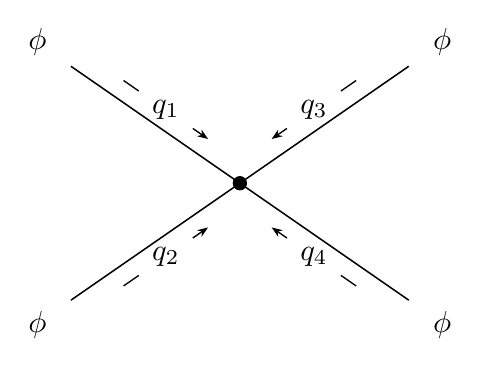
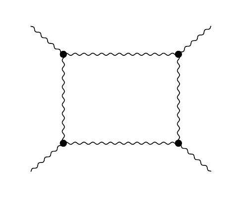
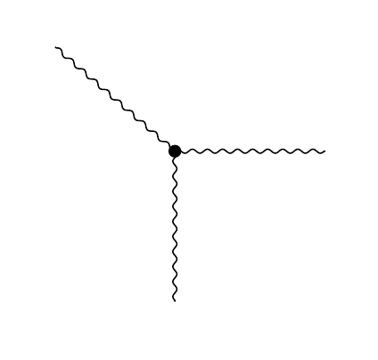
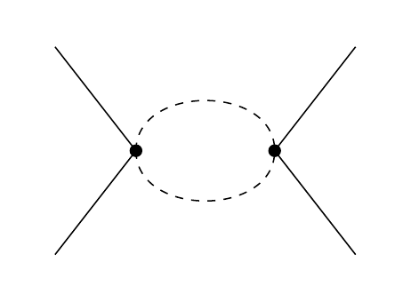
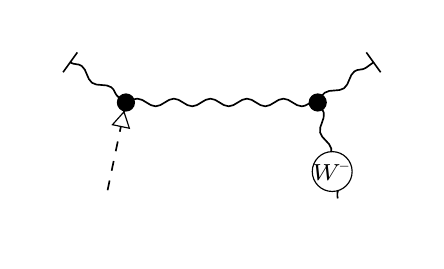
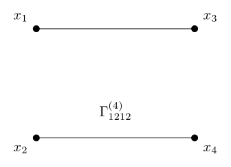

# Correlator Diagram Macros

Reusable LaTeX macros for the QFT diagrams that actually show up in notes, assignments, and writeups: correlators, contraction classes, amputated vertices, loop bubbles, one-loop boxes, and exchange channels.

Fast defaults when you just need the figure. One-option switches for common cleanup like hiding momenta. More detailed control when the geometry gets ugly.

## Tiny Examples

<table>
  <tr>
    <td valign="top" width="50%">
      <strong>Default 4-point correlator</strong><br>
      <sub>A readable starting point with field and momentum labels.</sub>
      <pre lang="tex">\FourPointCorr</pre>
      <p align="center">
        
      </p>
    </td>
    <td valign="top" width="50%">
      <strong>One-loop box</strong><br>
      <sub>A quiet topology view when momentum labels would be noise.</sub>
      <pre lang="tex">\BoxLoopCorr[field={}, show-momenta=false]</pre>
      <p align="center">
        
      </p>
    </td>
  </tr>
  <tr>
    <td valign="top" width="50%">
      <strong>3-point vertex</strong><br>
      <sub>EW boson-like legs with the annotations hidden.</sub>
      <pre lang="tex">\ThreePointCorr[line=ewboson, field={}, show-momenta=false]</pre>
      <p align="center">
        
      </p>
    </td>
    <td valign="top" width="50%">
      <strong>Loop channel</strong><br>
      <sub>A clean channel diagram with momentum annotations hidden.</sub>
      <pre lang="tex">\SChannelCorr[field={}, show-momenta=false]</pre>
      <p align="center">
        
      </p>
    </td>
  </tr>
  <tr>
    <td valign="top" width="50%">
      <strong>Half-box half-prop</strong><br>
      <sub>A vertex-identity helper with one circled lower half-propagator.</sub>
      <pre lang="tex">\HalfBoxCorr[half-box-style=halfpropright, half-box-right-lower-circ=Wm]</pre>
      <p align="center">
        
      </p>
    </td>
    <td valign="top" width="50%">
      <strong>Contact pairing</strong><br>
      <sub>A compact contact layout with external annotations hidden.</sub>
      <pre lang="tex">\FourPointCorr[external-legs=false, center-vertex=false]</pre>
      <p align="center">
        
      </p>
    </td>
  </tr>
</table>

The detailed geometry tuning is there when you need it, but the common cases above are meant to stay copy-pasteable.

## Highlights

- `\TwoPointCorr`, `\ThreePointCorr`, and `\FourPointCorr` as the main correlator entry points
- 3-point vertices via `\ThreePointCorr`, including per-leg styles, custom labels, and all-in/all-out momentum flow
- one-loop box diagrams via `\BoxLoopCorr` or `\FourPointCorr[topology=box]`
- crossed-box diagrams via `\CrossBoxCorr` or `\FourPointCorr[topology=cross-box]`
- triangle-contact diagrams via `\TriangleContactCorr` with top/bottom/left/right contact orientations and split color controls
- vertex-identity helpers via `\HalfBoxCorr` and `\FlatContactCorr`, including half-prop lower-leg styles
- one-loop `s`, `t`, and `u` channel bubbles via `\SChannelCorr`, `\TChannelCorr`, and `\UChannelCorr`
- explicit tree-level exchange topologies and contact pairings
- amputated correlators with endpoint vertices via `external-legs=false` or `amputated`
- quick cleanup switches like `show-momenta=false`
- a looser shared EW-boson/wavy style via `ewboson` or `EWboson`
- uniform propagator color via global `color=...`
- box-specific color controls for external and internal propagators
- deeper per-leg and per-internal-line styling when you need it
- external momentum flow presets such as `left-in-right-out`
- sunset self-energies are supported too, with a dedicated `\SunsetDiagram` macro

## Quick Start

Place `correlator-diagrams.sty` next to your document or in your local `texmf` tree, then load:

```tex
\usepackage{amsmath}
\usepackage{correlator-diagrams}
```

The package depends on standard LaTeX tools plus `tikz-feynhand`, all of which are loaded internally.

Main demo files in this repository:

- [`example.tex`](example.tex)
- [`vertex-example/vertex-example.tex`](vertex-example/vertex-example.tex)
- [`regressions/topologies/box/box-topology-regression.tex`](regressions/topologies/box/box-topology-regression.tex)
- [`regressions/topologies/channel/channel-topology-regression.tex`](regressions/topologies/channel/channel-topology-regression.tex)
- [`regressions/topologies/cross-box/cross-box-regression.tex`](regressions/topologies/cross-box/cross-box-regression.tex)
- [`regressions/topologies/triangle-contact/triangle-contact-regression.tex`](regressions/topologies/triangle-contact/triangle-contact-regression.tex)
- [`regressions/topologies/vertex-identity/vertex-identity-check.tex`](regressions/topologies/vertex-identity/vertex-identity-check.tex)
- [`regressions/topologies/three-point/three-point-check.tex`](regressions/topologies/three-point/three-point-check.tex)
- [`regressions/topologies/sunset/sunset-example.tex`](regressions/topologies/sunset/sunset-example.tex)
- [`regressions/topologies/sunset/sunset-index-regression.tex`](regressions/topologies/sunset/sunset-index-regression.tex)
- [`regressions/propagators/circ/propagator-circ-check.tex`](regressions/propagators/circ/propagator-circ-check.tex)
- [`regressions/propagators/proca/proca-regression.tex`](regressions/propagators/proca/proca-regression.tex)
- [`regressions/propagators/scalar-polarization/scalar-polarization-check.tex`](regressions/propagators/scalar-polarization/scalar-polarization-check.tex)

Compile with:

```sh
pdflatex -interaction=nonstopmode -halt-on-error example.tex
```

## Core Macros

```tex
\TwoPointCorr[...]
\ThreePointCorr[...]
\FourPointCorr[...]
\HalfBoxCorr[...]
\FlatContactCorr[...]
\SunsetDiagram[...]
```

Common wrappers and aliases:

```tex
\TwoPtCorr[...]
\ThreePtCorr[...]
\FourPtCorr[...]
\BoxLoopCorr[...]
\CrossBoxCorr[...]
\HalfBoxCorr[...]
\FlatContactCorr[...]
\TriangleContactCorr[...]
\SChannelCorr[...]
\TChannelCorr[...]
\UChannelCorr[...]
\STreeChannelCorr[...]
\TTreeChannelCorr[...]
\UTreeChannelCorr[...]
\SunsetDiag[...]
```

## Documentation

- Start with [`example.tex`](example.tex) if you want copy-paste examples.
- Use [`docs/reference.md`](docs/reference.md) for the full macro and tuning reference.
- Use [`vertex-example/vertex-example.tex`](vertex-example/vertex-example.tex) for the compact vertex-identity sketch.
- Use [`regressions/topologies/channel/channel-topology-regression.tex`](regressions/topologies/channel/channel-topology-regression.tex) to inspect channel layouts in isolation.
- Use [`regressions/topologies/box/box-topology-regression.tex`](regressions/topologies/box/box-topology-regression.tex) to inspect the one-loop box topology in isolation.
- Use [`regressions/topologies/cross-box/cross-box-regression.tex`](regressions/topologies/cross-box/cross-box-regression.tex) to inspect the crossed-box topology in isolation.
- Use [`regressions/topologies/triangle-contact/triangle-contact-regression.tex`](regressions/topologies/triangle-contact/triangle-contact-regression.tex) to inspect triangle-contact orientations.
- Use [`regressions/topologies/three-point/three-point-check.tex`](regressions/topologies/three-point/three-point-check.tex) to verify the 3-point topology and momentum placement.
- Use [`regressions/propagators/endpoint-markers/endpoint-marker-regression.tex`](regressions/propagators/endpoint-markers/endpoint-marker-regression.tex) to verify endpoint arrow and endcap add-ons.
- Use [`regressions/propagators/scalar-polarization/scalar-polarization-check.tex`](regressions/propagators/scalar-polarization/scalar-polarization-check.tex) to verify single-leg scalar-polarized placement and arrow-size changes.
- Use [`regressions/topologies/sunset/sunset-example.tex`](regressions/topologies/sunset/sunset-example.tex) to inspect the current sunset topology.

The full reference covers:

- slot order and leg ordering
- 3-point vertex and one-loop box topologies
- vertex-identity half-box helpers and half-prop lower-leg circ markers
- momentum labels, arrow tuning, 3-point momentum layout presets, and box direction controls
- box edge labels and mixed external leg styles
- loop-channel and sunset layout controls
- line styles, vertices, colors, endpoint markers, and scalar-polarized legs
- one-loop `s/t/u` channels, tree channels, and sunset diagrams

## Repository Layout

- `correlator-diagrams.sty`: package source
- `example.tex`: broad feature gallery
- `regressions/topologies/`: focused topology regression cases
- `regressions/propagators/`: focused propagator regression and capacity sheets
- `assets/`: README graphics

## License

[MIT](LICENSE)
