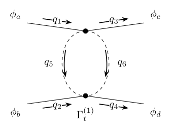

# Correlator Diagram Macros

Reusable LaTeX macros for the QFT diagrams that actually show up in notes, assignments, and writeups: correlators, contraction classes, amputated vertices, loop bubbles, and exchange channels.

Fast defaults when you just need the figure. One-option switches for common cleanup like hiding momenta. More detailed control when the geometry gets ugly.

## In A Few Lines

<table>
  <tr>
    <td valign="top" width="50%">
      <strong>Default 4-point correlator</strong><br>
      <sub>External labels and momenta from one readable macro call.</sub>
      <pre lang="tex">\FourPointCorr[
  field=\phi,
  indices={a,b,c,d},
  central=\Gamma^{(4)}
]</pre>
      <p align="center">
        
      </p>
    </td>
    <td valign="top" width="50%">
      <strong>Change the flow convention</strong><br>
      <sub>Use left-in/right-out momentum arrows without redrawing the figure.</sub>
      <pre lang="tex">\TChannelCorr[
  external-momentum-flow=left-in-right-out,
  field=\phi,
  indices={a,b,c,d},
  central=\Gamma^{(1)}_{t}
]</pre>
      <p align="center">
        
      </p>
    </td>
  </tr>
  <tr>
    <td valign="top" width="50%">
      <strong>Amputate and pair the fields</strong><br>
      <sub>Switch from a central vertex to a direct contraction pattern.</sub>
      <pre lang="tex">\FourPointCorr[
  external-legs=false,
  center-vertex=false,
  show-momenta=false,
  contact-pairing=horizontal,
  field=x,
  indices={1,2,3,4},
  central=\Gamma^{(4)}_{1212}
]</pre>
      <p align="center">
        
      </p>
    </td>
    <td valign="top" width="50%">
      <strong>Color the whole topology</strong><br>
      <sub>One option for a uniform diagram style.</sub>
      <pre lang="tex">\SChannelCorr[
  color=blue,
  show-momenta=false,
  field=\phi,
  indices={a,b,c,d},
  central=\Gamma^{(1)}_{s}
]</pre>
      <p align="center">
        
      </p>
    </td>
  </tr>
</table>

The detailed geometry tuning is there when you need it, but the common cases above are meant to stay copy-pasteable.

## Highlights

- `\TwoPointCorr` and `\FourPointCorr` as the main entry points
- one-loop `s`, `t`, and `u` channel bubbles via `\SChannelCorr`, `\TChannelCorr`, and `\UChannelCorr`
- explicit tree-level exchange topologies and contact pairings
- amputated correlators with endpoint vertices via `external-legs=false` or `amputated`
- quick cleanup switches like `show-momenta=false`
- uniform propagator color via global `color=...`
- deeper per-leg and per-internal-line styling when you need it
- external momentum flow presets such as `left-in-right-out`
- sunset self-energies are supported too, with a dedicated `\SunsetDiagram` macro

## Quick Start

Place `correlator-diagrams.sty` next to your document or in your local `texmf` tree, then load:

```tex
\usepackage{amsmath}
\usepackage{correlator-diagrams}
```

The package depends on standard LaTeX tools plus `tikz-feynhand`, all of which are loaded internally.

Main demo files in this repository:

- [`example.tex`](example.tex)
- [`channel-topology-regression.tex`](channel-topology-regression.tex)
- [`scalar-polarization-check.tex`](scalar-polarization-check.tex)
- [`sunset-example.tex`](sunset-example.tex)
- [`simple-sunset.tex`](simple-sunset.tex)

Compile with:

```sh
pdflatex -interaction=nonstopmode -halt-on-error example.tex
```

## Core Macros

```tex
\TwoPointCorr[...]
\FourPointCorr[...]
\SunsetDiagram[...]
```

Common wrappers and aliases:

```tex
\SChannelCorr[...]
\TChannelCorr[...]
\UChannelCorr[...]
\STreeChannelCorr[...]
\TTreeChannelCorr[...]
\UTreeChannelCorr[...]
\SunsetDiag[...]
```

## Documentation

- Start with [`example.tex`](example.tex) if you want copy-paste examples.
- Use [`docs/reference.md`](docs/reference.md) for the full macro and tuning reference.
- Use [`channel-topology-regression.tex`](channel-topology-regression.tex) to inspect channel layouts in isolation.
- Use [`scalar-polarization-check.tex`](scalar-polarization-check.tex) to verify single-leg scalar-polarized placement and arrow-size changes.

The full reference covers:

- slot order and leg ordering
- momentum labels and arrow tuning
- loop-channel and sunset layout controls
- line styles, vertices, colors, and scalar-polarized legs
- one-loop `s/t/u` channels, tree channels, and sunset diagrams

## Repository Layout

- `correlator-diagrams.sty`: package source
- `example.tex`: broad feature gallery
- `channel-topology-regression.tex`: focused channel regression cases
- `scalar-polarization-check.tex`: single-leg scalar-polarized regression cases
- `sunset-example.tex`: sunset-specific examples
- `assets/`: README graphics

## License

[MIT](LICENSE)
