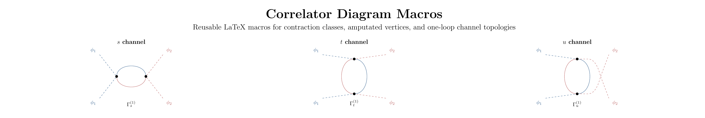
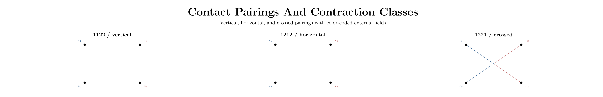

# Correlator Diagram Macros Reference

Back to the landing page: [README](../README.md)

This file preserves the full package reference, API notes, and tuning recipes.



Reusable LaTeX macros for QFT correlators, contraction classes, amputated vertices, and loop/tree channel topologies.

This package was built for real notes, assignments, and writeups where the diagrams need to look intentional without hand-tuning raw TikZ every time. It is especially useful when you want:

- 2-point and 4-point correlators with consistent slot ordering
- contact pairings beyond the central vertex layout, including `vertical`, `horizontal`, and `crossed`
- one-loop `s`, `t`, and `u` channel bubbles for `\phi^4`-style diagrams
- explicit tree-level `s`, `t`, and `u` exchange topologies
- sunset self-energy diagrams
- color-coded multi-field figures like `\phi_1^2 \phi_2^2` contraction classes
- per-leg, per-internal-line, and per-channel control over styles, labels, indices, and momentum arrows

The visuals below are generated from the same kinds of contraction and channel diagrams used in actual QFT coursework notes:



## Quick Start

Main package:

- `correlator-diagrams.sty`

Main demos:

- `example.tex`
- `channel-topology-regression.tex`
- `sunset-example.tex`
- `simple-sunset.tex`

Add the package to your document:

```tex
\usepackage{amsmath}
\usepackage{correlator-diagrams}
```

The three main entry points are:

```tex
\TwoPointCorr[...]
\FourPointCorr[...]
\SunsetDiagram[...]
```

Common aliases:

```tex
\TwoPtCorr[...]
\FourPtCorr[...]
\SChannelCorr[...]
\TChannelCorr[...]
\UChannelCorr[...]
\SLoopChannelCorr[...]
\TLoopChannelCorr[...]
\ULoopChannelCorr[...]
\STreeChannelCorr[...]
\TTreeChannelCorr[...]
\UTreeChannelCorr[...]
\SunsetDiag[...]
```

Compile locally with:

```sh
pdflatex -interaction=nonstopmode -halt-on-error example.tex
```

If you want the fastest first pass, start with `example.tex`, then copy one of the channel or contact examples and adjust the topology, labels, and line styles.

## The Basic Workflow

Most diagrams are easiest if you think in this order:

1. Pick the topology.
2. Label the external fields.
3. Label the momenta.
4. Adjust line styles, arrows, and vertices.
5. Add internal indices if the topology has internal propagators.

That is the logic used by this package.

## What Each Macro Draws

| Macro | Purpose | Default shape |
| --- | --- | --- |
| `\TwoPointCorr` | 2-point function | left leg, right leg, central blob/vertex |
| `\FourPointCorr` | 4-point object | contact topology by default |
| `\SunsetDiagram` | self-energy sunset | two external legs plus top/middle/bottom internal lines |

The convenience channel wrappers are just `\FourPointCorr` with a fixed topology:

- `\SChannelCorr`, `\TChannelCorr`, `\UChannelCorr` for the one-loop `\phi^4` bubbles
- `\STreeChannelCorr`, `\TTreeChannelCorr`, `\UTreeChannelCorr` for the explicit tree-level exchange graphs

## Leg Order And Slot Order

### `\TwoPointCorr`

- slot 1 = left leg
- slot 2 = right leg

### `\FourPointCorr`

External leg order is always:

- slot 1 = upper left
- slot 2 = lower left
- slot 3 = upper right
- slot 4 = lower right

For one-loop channel bubbles there are two extra internal propagator slots:

- slot 5 = internal line A
- slot 6 = internal line B

Interpretation of A/B depends on the topology:

- `topology=s`: A = top arc, B = bottom arc
- `topology=t`: A = left arc, B = right arc
- `topology=u`: A = left arc, B = right arc

That slot order matters for:

- `leg-styles={...}`
- `momentum-labels={...}`
- `momentum-arrow-sizes={...}`
- `propagator-arrow-sizes={...}`

### `\SunsetDiagram`

External legs:

- slot 1 = left external segment
- slot 2 = right external segment

Internal segments:

- slot 3 = top arc
- slot 4 = middle bridge
- slot 5 = bottom arc

## Quick Start Examples

### Automatic `q_i`, `k_i`, or `p_i` labels

```tex
\[
  \FourPointCorr[
    mode=q
  ]
\]
```

Supported built-in momentum letters:

- `mode=q`
- `mode=k`
- `mode=p`

You can also shift the numbering:

```tex
\[
  \FourPointCorr[
    mode=q,
    momentum-start=3
  ]
\]
```

### External labels from `field` plus `indices`

```tex
\[
  \FourPointCorr[
    field=\phi,
    indices={a,b,c,d},
    central=G^{(4)}
  ]
\]
```

This gives `\phi_a`, `\phi_b`, `\phi_c`, `\phi_d`.

### Fully manual external labels

```tex
\[
  \FourPointCorr[
    leg-labels={\psi_i,\bar\psi_j,\psi_k,\bar\psi_l},
    momentum-labels={p_1,p_2,p_3,p_4},
    central=\Gamma^{(4)}
  ]
\]
```

### Visible vertex, no blob

```tex
\[
  \FourPointCorr[
    blob=false,
    center-vertex-style=ringdot
  ]
\]
```

## External Field Labels

The standard pattern is:

- `field=\phi`
- `indices={...}`

Index placement:

- `index-placement=sub`
- `index-placement=sup`
- `index-placement=none`

If you need complete manual control, use:

- `leg-labels={...}`

`leg-labels` overrides `field` and `indices` for the legs you specify.

## Momentum Labels And Arrows

### First: what kind of key moves what?

For momentum annotations, the naming pattern matters:

- `loop-channel-top-momentum=\ell` changes the text itself
- `loop-channel-top-arrow-yshift=14pt` changes the arrow only
- `loop-channel-top-label-yshift=14pt` changes the label only
- `loop-channel-top-label-distance=12pt` changes the separation between label and arrow
- `loop-channel-top-label-fraction=0.50` slides the label along the same line or curve
- `loop-channel-top-arrow-start=0.24` and `loop-channel-top-arrow-end=0.76` shorten or lengthen the arrow along its line or curve

That is the quickest way to read the API.

### Global momentum text style

For simple diagrams you can rely on:

- `mode=q|k|p`
- `momentum-start=<integer>`
- `momentum-labels={...}`

Momentum labels are plain text by default. There is no white box behind them unless you add one yourself with:

- `momentum-label-fill=...`
- `momentum-label-inner-sep=...`
- `momentum-label-style=...`

### One-loop `s/t/u` bubbles: the internal loop momenta

This is the part of the package where the label and arrow are most clearly treated as one annotation attached to one loop line.

If you do not want to mentally decode key families, skip straight to the paste-ready blocks below and edit one number at a time.

Use these names for the momentum text:

- `loop-channel-top-momentum=...`
- `loop-channel-bottom-momentum=...`
- `loop-channel-left-momentum=...`
- `loop-channel-right-momentum=...`
- `loop-channel-momenta={..., ...}`

You can also use the equivalent `a/b` names:

- `loop-channel-a-momentum=...`
- `loop-channel-b-momentum=...`

Direction:

- `loop-channel-top-momentum-direction=forward|reverse|none`
- `loop-channel-bottom-momentum-direction=forward|reverse|none`
- `loop-channel-left-momentum-direction=forward|reverse|none`
- `loop-channel-right-momentum-direction=forward|reverse|none`

#### Loop-channel motion cheat sheet

If you want to do this | Use this key family | What it changes
--- | --- | ---
Change the label text | `loop-channel-top-momentum=...` | text only
Move the label farther from the arrow | `loop-channel-top-label-distance=...` | label-arrow separation only
Slide the label along the same curve | `loop-channel-top-label-fraction=...` | label position along the curve
Change the side the label sits on | `loop-channel-top-label-position=above|below|left|right` | anchor side for the label
Nudge only the label | `loop-channel-top-label-xshift=...`, `loop-channel-top-label-yshift=...` | label only
Shorten or lengthen the arrow | `loop-channel-top-arrow-start=...`, `loop-channel-top-arrow-end=...` | arrow span only
Move the arrow guide away from the loop | `loop-channel-top-arrow-yshift=...` or `loop-channel-left-arrow-xshift=...` | arrow only
Change how curved the arrow guide feels | `loop-channel-top-arrow-looseness=...` | arrow curvature only

Replace `top` with `bottom`, `left`, or `right` as needed.

#### The two-step tuning workflow for loop-channel momenta

If a label is overlapping its arrow:

1. Increase `loop-channel-top-label-distance` or `loop-channel-left-label-distance`.
2. If the label should also slide along the curve, change `loop-channel-top-label-fraction` or `loop-channel-left-label-fraction`.

If the label and arrow look fine relative to each other, but the whole thing is too close to the loop or to the page edge:

1. Keep your chosen `loop-channel-top-label-distance` or `loop-channel-left-label-distance`.
2. Move the arrow with `loop-channel-top-arrow-yshift` or `loop-channel-left-arrow-xshift`.
3. Move the label by the same amount with `loop-channel-top-label-yshift` or `loop-channel-left-label-xshift`.

Example: separate first, then move together:

```tex
\[
  \TChannelCorr[
    loop-channel-left-momentum=\ell,
    loop-channel-left-label-distance=10pt,
    loop-channel-left-arrow-xshift=-6pt,
    loop-channel-left-label-xshift=-6pt
  ]
\]
```

Here the logic is:

- `label-distance` opens space between text and arrow
- matching `arrow-xshift` and `label-xshift` move the whole annotation left together

Example: vertical version for the `s` channel:

```tex
\[
  \SChannelCorr[
    loop-channel-top-label-distance=12pt,
    loop-channel-top-arrow-yshift=14pt,
    loop-channel-top-label-yshift=14pt
  ]
\]
```

Here the top momentum label is first pushed away from the arrow, and then the arrow+label pair is lifted upward together.

#### Paste-ready default blocks

Use these as real starting points.

Default `s`-channel internal loop momenta:

```tex
\[
  \SChannelCorr[
    loop-channel-top-momentum=\ell,
    loop-channel-top-momentum-direction=forward,
    loop-channel-top-arrow-start=0.24,
    loop-channel-top-arrow-end=0.76,
    loop-channel-top-arrow-xshift=0pt,
    loop-channel-top-arrow-yshift=13pt,
    loop-channel-top-arrow-looseness=1.02,
    loop-channel-top-label-position=above,
    loop-channel-top-label-distance=10pt,
    loop-channel-top-label-fraction=0.50,
    loop-channel-top-label-xshift=0pt,
    loop-channel-top-label-yshift=0pt,
    loop-channel-bottom-momentum=p_1+p_2-\ell,
    loop-channel-bottom-momentum-direction=forward,
    loop-channel-bottom-arrow-start=0.24,
    loop-channel-bottom-arrow-end=0.76,
    loop-channel-bottom-arrow-xshift=0pt,
    loop-channel-bottom-arrow-yshift=-13pt,
    loop-channel-bottom-arrow-looseness=1.02,
    loop-channel-bottom-label-position=below,
    loop-channel-bottom-label-distance=10pt,
    loop-channel-bottom-label-fraction=0.50,
    loop-channel-bottom-label-xshift=0pt,
    loop-channel-bottom-label-yshift=0pt
  ]
\]
```

Default `t`-channel internal loop momenta:

```tex
\[
  \TChannelCorr[
    loop-channel-left-momentum=\ell,
    loop-channel-left-momentum-direction=forward,
    loop-channel-left-arrow-start=0.24,
    loop-channel-left-arrow-end=0.76,
    loop-channel-left-arrow-xshift=-18pt,
    loop-channel-left-arrow-yshift=0pt,
    loop-channel-left-arrow-looseness=1.02,
    loop-channel-left-label-position=left,
    loop-channel-left-label-distance=9pt,
    loop-channel-left-label-fraction=0.50,
    loop-channel-left-label-xshift=0pt,
    loop-channel-left-label-yshift=0pt,
    loop-channel-right-momentum=q-\ell,
    loop-channel-right-momentum-direction=forward,
    loop-channel-right-arrow-start=0.24,
    loop-channel-right-arrow-end=0.76,
    loop-channel-right-arrow-xshift=18pt,
    loop-channel-right-arrow-yshift=0pt,
    loop-channel-right-arrow-looseness=1.02,
    loop-channel-right-label-position=right,
    loop-channel-right-label-distance=9pt,
    loop-channel-right-label-fraction=0.50,
    loop-channel-right-label-xshift=0pt,
    loop-channel-right-label-yshift=0pt
  ]
\]
```

Default `u`-channel internal loop momenta and crossed right-side external momenta:

```tex
\[
  \UChannelCorr[
    loop-channel-left-momentum=\ell,
    loop-channel-left-momentum-direction=forward,
    loop-channel-left-arrow-start=0.24,
    loop-channel-left-arrow-end=0.76,
    loop-channel-left-arrow-xshift=-18pt,
    loop-channel-left-arrow-yshift=0pt,
    loop-channel-left-arrow-looseness=1.02,
    loop-channel-left-label-position=left,
    loop-channel-left-label-distance=9pt,
    loop-channel-left-label-fraction=0.50,
    loop-channel-left-label-xshift=0pt,
    loop-channel-left-label-yshift=0pt,
    loop-channel-right-momentum=r-\ell,
    loop-channel-right-momentum-direction=forward,
    loop-channel-right-arrow-start=0.24,
    loop-channel-right-arrow-end=0.76,
    loop-channel-right-arrow-xshift=18pt,
    loop-channel-right-arrow-yshift=0pt,
    loop-channel-right-arrow-looseness=1.02,
    loop-channel-right-label-position=right,
    loop-channel-right-label-distance=11pt,
    loop-channel-right-label-fraction=0.50,
    loop-channel-right-label-xshift=4pt,
    loop-channel-right-label-yshift=6pt,
    loop-channel-crossed-external-momentum-start=0.00,
    loop-channel-crossed-external-momentum-end=0.24,
    loop-channel-crossed-external-momentum-label-fraction=0.08
  ]
\]
```

#### How to start guessing adjustments

Use these as the first numbers to change:

- `loop-channel-top-label-distance`, `loop-channel-bottom-label-distance`, `loop-channel-left-label-distance`, `loop-channel-right-label-distance`
  Defaults: `10pt` for `s`, `9pt` for `t`, `11pt` for the crowded right side of `u`.
  Bigger means more space between label and arrow.
  Smaller means label sits closer to the arrow.

- `loop-channel-top-arrow-looseness`, `loop-channel-bottom-arrow-looseness`, `loop-channel-left-arrow-looseness`, `loop-channel-right-arrow-looseness`
  Default: `1.02`.
  Bigger means the guide arrow bows farther and looks rounder.
  Smaller means the guide arrow gets flatter and tighter.

- `loop-channel-top-label-fraction`, `loop-channel-bottom-label-fraction`, `loop-channel-left-label-fraction`, `loop-channel-right-label-fraction`
  Default: `0.50`.
  Smaller means the label moves toward the first end of the arrow.
  Bigger means the label moves toward the second end of the arrow.

- `loop-channel-top-arrow-start`, `loop-channel-bottom-arrow-start`, `loop-channel-left-arrow-start`, `loop-channel-right-arrow-start`
  Default: `0.24`.
  Bigger means the arrow starts later, so the arrow gets shorter near its first end.
  Smaller means the arrow reaches farther toward its first end.

- `loop-channel-top-arrow-end`, `loop-channel-bottom-arrow-end`, `loop-channel-left-arrow-end`, `loop-channel-right-arrow-end`
  Default: `0.76`.
  Bigger means the arrow reaches farther toward its second end.
  Smaller means the arrow stops earlier, so it gets shorter near its second end.

- `loop-channel-top-arrow-yshift`, `loop-channel-bottom-arrow-yshift`, `loop-channel-left-arrow-xshift`, and `loop-channel-right-arrow-xshift`
  Defaults: `0pt` / `13pt` / `-13pt` in `s`, `-18pt` and `18pt` in `t/u`.
  Bigger absolute value means you push the arrow farther away from the loop in that direction.

When something still looks bad, this is the recommended order:

1. Change `label-distance`.
2. Change `label-fraction`.
3. Change `arrow-start` / `arrow-end`.
4. Change `arrow-looseness`.
5. Only then start moving the pair around with matching arrow and label shifts.

#### Loop-channel fix-it recipes

If the top `s`-channel label is sitting on top of its arrow:

```tex
\[
  \SChannelCorr[
    loop-channel-top-label-distance=14pt
  ]
\]
```

If that same top `s`-channel label is fine relative to the arrow, but the whole top annotation is still too low:

```tex
\[
  \SChannelCorr[
    loop-channel-top-label-distance=14pt,
    loop-channel-top-arrow-yshift=18pt,
    loop-channel-top-label-yshift=5pt
  ]
\]
```

Why this works:

- `label-distance=14pt` opens the gap
- arrow `13pt -> 18pt` moves the arrow up
- label `0pt -> 5pt` moves the label up by the same extra `5pt`

If the left `t`-channel label is sitting on the arrow:

```tex
\[
  \TChannelCorr[
    loop-channel-left-label-distance=12pt
  ]
\]
```

If the left `t`-channel annotation is too close to the loop and needs to move farther left as one unit:

```tex
\[
  \TChannelCorr[
    loop-channel-left-label-distance=12pt,
    loop-channel-left-arrow-xshift=-24pt,
    loop-channel-left-label-xshift=-6pt
  ]
\]
```

Why this works:

- default left arrow shift is `-18pt`
- changing it to `-24pt` moves the arrow `6pt` farther left
- changing the label from `0pt` to `-6pt` moves the label left by the same extra amount

If the loop arrow looks too flat and not curved enough:

```tex
\[
  \TChannelCorr[
    loop-channel-left-arrow-looseness=1.20,
    loop-channel-right-arrow-looseness=1.20
  ]
\]
```

If the loop arrow looks too round and exaggerated:

```tex
\[
  \TChannelCorr[
    loop-channel-left-arrow-looseness=0.90,
    loop-channel-right-arrow-looseness=0.90
  ]
\]
```

If the right side of the `u` channel is crowded:

```tex
\[
  \UChannelCorr[
    loop-channel-right-label-distance=13pt,
    loop-channel-right-label-xshift=6pt,
    loop-channel-right-label-yshift=8pt,
    loop-channel-crossed-external-momentum-start=0.00,
    loop-channel-crossed-external-momentum-end=0.20,
    loop-channel-crossed-external-momentum-label-fraction=0.06
  ]
\]
```

Why this works:

- the right loop label gets farther from its arrow
- the right loop label is nudged farther out and slightly up
- the crossed external momentum marks move closer to the outer leg ends, away from the crossing

### One-loop `s/t/u` bubbles: external straight-leg momenta

The straight external momentum arrows use a simpler system:

- `loop-channel-external-momentum-start=...`
- `loop-channel-external-momentum-end=...`
- `loop-channel-external-momentum-label-fraction=...`

For the crossed right side of the one-loop `u` channel:

- `loop-channel-crossed-external-momentum-start=...`
- `loop-channel-crossed-external-momentum-end=...`
- `loop-channel-crossed-external-momentum-label-fraction=...`

These do:

- `start/end`: shorten or lengthen the arrow segment along the external leg
- `label-fraction`: slide the label along that same segment

They do not provide a separate `label-distance` control. Use them to keep the external momentum marking away from a crowded vertex or crossing.

Paste-ready external momentum defaults for `t`:

```tex
\[
  \TChannelCorr[
    loop-channel-external-momentum-start=0.08,
    loop-channel-external-momentum-end=0.52,
    loop-channel-external-momentum-label-fraction=0.26
  ]
\]
```

Paste-ready crossed external momentum defaults for `u`:

```tex
\[
  \UChannelCorr[
    loop-channel-crossed-external-momentum-start=0.00,
    loop-channel-crossed-external-momentum-end=0.24,
    loop-channel-crossed-external-momentum-label-fraction=0.08
  ]
\]
```

Quick intuition:

- smaller `...-start` moves the arrow closer to the outer end of the leg
- bigger `...-end` extends the arrow farther toward the vertex
- smaller `...-label-fraction` moves the label toward the outer end
- bigger `...-label-fraction` moves the label toward the vertex

Important:

- `loop-channel-*` keys are for the one-loop `s/t/u` bubbles.
- `channel-*` keys belong to the explicit tree-level exchange topologies.

### Sunset diagrams: momentum tuning

For sunsets, the momentum text keys are:

- `sunset-external-momentum=...`
- `sunset-top-momentum=...`
- `sunset-middle-momentum=...`
- `sunset-bottom-momentum=...`

Sunset momentum control is slightly different from the loop-channel system:

- there is no dedicated `sunset-top-label-distance` / `sunset-middle-label-distance` / `sunset-bottom-label-distance` key
- instead, you usually start from `sunset-momentum-layout=compact|balanced|wide`
- then you tune arrow and label shifts separately
- there is not yet a one-key "move arrow and label together" command for sunsets, so matching shift edits are the way to do that

#### Sunset motion cheat sheet

If you want to do this | Use this key family | What it changes
--- | --- | ---
Use a broader default spacing preset | `sunset-momentum-layout=compact|balanced|wide` | whole momentum layout preset
Move only the top arrow | `sunset-top-arrow-yshift=...` | top arrow only
Move only the top label | `sunset-top-label-xshift=...`, `sunset-top-label-yshift=...` | top label only
Move the top arrow and top label together | add the same amount to `sunset-top-arrow-yshift` and `sunset-top-label-yshift` | top pair together
Move only the middle arrow | `sunset-middle-arrow-yshift=...` | middle arrow only
Shorten or lengthen the middle arrow | `sunset-middle-arrow-start=...`, `sunset-middle-arrow-end=...` | middle arrow span only
Move only the middle label | `sunset-middle-label-xshift=...`, `sunset-middle-label-yshift=...` | middle label only
Move only the bottom arrow | `sunset-bottom-arrow-yshift=...` | bottom arrow only
Move only the bottom label | `sunset-bottom-label-xshift=...`, `sunset-bottom-label-yshift=...` | bottom label only

So for sunset diagrams the workflow is:

1. Pick `sunset-momentum-layout=...`.
2. If the label is too close to indices, increase `sunset-top-label-index-clearance`, `sunset-middle-label-index-clearance`, or `sunset-bottom-label-index-clearance`.
3. If the label is too close to its own arrow, increase the difference between the arrow shift and the label shift.
4. If the pair is clear internally but sitting in the wrong place, apply a matching extra shift to both the arrow and the label.

Example:

```tex
\[
  \SunsetDiagram[
    sunset-top-momentum=k,
    sunset-top-arrow-yshift=18pt,
    sunset-top-label-yshift=24pt
  ]
\]
```

This does two different things:

- the arrow is raised to `18pt`
- the label is raised even more, to `24pt`, so the label sits farther above the arrow

If instead you wanted to move the existing top annotation upward together without changing its internal spacing, you would add the same amount to both values.

#### Paste-ready sunset defaults

Balanced sunset momentum layout, written out explicitly:

```tex
\[
  \SunsetDiagram[
    sunset-momentum-layout=balanced,
    sunset-top-momentum=k,
    sunset-top-label-position=above,
    sunset-top-label-xshift=0pt,
    sunset-top-label-yshift=27pt,
    sunset-top-arrow-yshift=22pt,
    sunset-top-arrow-bend=12,
    sunset-middle-momentum=p-k-q,
    sunset-middle-label-position=below,
    sunset-middle-label-xshift=0pt,
    sunset-middle-label-yshift=-1pt,
    sunset-middle-arrow-start=0.24,
    sunset-middle-arrow-end=0.76,
    sunset-middle-arrow-yshift=12pt,
    sunset-bottom-momentum=q,
    sunset-bottom-label-position=below,
    sunset-bottom-label-xshift=0pt,
    sunset-bottom-label-yshift=-12pt,
    sunset-bottom-arrow-yshift=-15pt,
    sunset-bottom-arrow-bend=12
  ]
\]
```

The preset values behind the three sunset momentum layouts are:

- `compact`
  Top arrow `18pt`, top label `18pt`, middle arrow `8pt`, middle label `0pt`, bottom arrow `-12pt`, bottom label `-8pt`

- `balanced`
  Top arrow `22pt`, top label `27pt`, middle arrow `12pt`, middle label `-1pt`, bottom arrow `-15pt`, bottom label `-12pt`

- `wide`
  Top arrow `27pt`, top label `33pt`, middle arrow `15pt`, middle label `1pt`, bottom arrow `-20pt`, bottom label `-16pt`

Quick intuition for sunset guessing:

- if everything is cramped, start by switching `compact -> balanced -> wide`
- if the label is too close to the arrow, increase the difference between the label shift and the arrow shift
- if the label is too close to an index, increase `sunset-top-label-index-clearance`, `sunset-middle-label-index-clearance`, or `sunset-bottom-label-index-clearance`
- if the pair is fine internally but sitting too high/low, add the same extra amount to both the arrow shift and the label shift

#### Sunset fix-it recipes

If the top sunset label is sitting too close to the top arrow:

```tex
\[
  \SunsetDiagram[
    sunset-top-arrow-yshift=22pt,
    sunset-top-label-yshift=31pt
  ]
\]
```

Why this works:

- default top arrow is `22pt`
- default top label is `27pt`
- raising the label to `31pt` increases the gap by `4pt`

If the whole top sunset annotation needs to move upward together after that:

```tex
\[
  \SunsetDiagram[
    sunset-top-arrow-yshift=26pt,
    sunset-top-label-yshift=35pt
  ]
\]
```

Why this works:

- the original gap is preserved
- both parts are moved upward by `4pt`

If the middle sunset label is too close to the middle arrow:

```tex
\[
  \SunsetDiagram[
    sunset-middle-arrow-yshift=12pt,
    sunset-middle-label-yshift=-5pt
  ]
\]
```

That increases the label/arrow separation because the arrow stays at `12pt` while the label is pushed farther downward.

If the middle sunset label is hitting internal indices:

```tex
\[
  \SunsetDiagram[
    sunset-middle-label-index-clearance=10pt
  ]
\]
```

If the bottom sunset label is too close to the bottom arrow:

```tex
\[
  \SunsetDiagram[
    sunset-bottom-arrow-yshift=-15pt,
    sunset-bottom-label-yshift=-16pt
  ]
\]
```

If the entire sunset momentum layout feels cramped and you do not want to tune line by line yet:

```tex
\[
  \SunsetDiagram[
    sunset-momentum-layout=wide
  ]
\]
```

If you want the full current balanced default as a safe reset before making changes:

```tex
\[
  \SunsetDiagram[
    sunset-momentum-layout=balanced,
    sunset-top-arrow-yshift=22pt,
    sunset-top-label-yshift=27pt,
    sunset-middle-arrow-yshift=12pt,
    sunset-middle-label-yshift=-1pt,
    sunset-bottom-arrow-yshift=-15pt,
    sunset-bottom-label-yshift=-12pt
  ]
\]
```

### Tree-level exchange channels

The tree-level exchange topologies use the older `channel-*` family instead of `loop-channel-*`.

The most important motion keys there are:

- `channel-momentum-start=...`
- `channel-momentum-end=...`
- `channel-momentum-distance=...`
- `channel-momentum-angle=...`
- `channel-momentum-label-position=...`
- `channel-momentum-label-xshift=...`
- `channel-momentum-label-yshift=...`

The logic is:

- `distance` and `angle` place the internal momentum arrow line relative to the propagator
- `label-xshift/yshift` then nudge the text

## Line Styles, Arrows, And Vertices

Global line style:

```tex
\[
  \FourPointCorr[
    line=fer
  ]
\]
```

Per-leg overrides:

```tex
\[
  \FourPointCorr[
    line=plain,
    leg-styles={scalarpolarized,scalarpolarized,plain,plain}
  ]
\]
```

Arrow sizing:

- `momentum-arrow-size=...`
- `momentum-arrow-sizes={...}`
- `propagator-arrow-size=...`
- `propagator-arrow-sizes={...}`

Visibility and vertex controls:

- `blob=true|false`
- `blob-style=...`
- `center-vertex=true|false`
- `center-vertex-style=dot|ringdot|...`
- `external-vertices=true|false`
- `external-vertex-style=dot|ringdot|...`
- `vertices=true|false`
- `vertex-style=...`
- `scale=...`

Default behavior:

- 2-point and 4-point diagrams show the central blob
- visible center vertices are on by default
- external endpoint vertices are off by default
- sunset diagrams show the two internal interaction vertices

## Scalar-Polarized Legs

Special dashed scalar styles with open arrowheads:

- `scalarpolarized`
- `antiscalarpolarized`
- `spol`
- `antspol`

Directional aliases:

- `scalarpolarizedin`
- `scalarpolarizedout`
- `antiscalarpolarizedin`
- `antiscalarpolarizedout`
- `spolin`
- `spolout`
- `antspolin`
- `antspolout`

Relevant controls:

- `scalar-arrow-direction=in|out|none`
- `scalar-arrow-position=<0..1>`
- `anti-scalar-arrow-direction=in|out|none`
- `anti-scalar-arrow-position=<0..1>`

The open arrowhead size tracks the normal propagator arrow-size controls.

## One-Loop `s/t/u` Channel Bubbles For `\phi^4`

These are the primary channel macros:

```tex
\SChannelCorr[...]
\TChannelCorr[...]
\UChannelCorr[...]
```

Equivalent explicit forms:

```tex
\FourPointCorr[topology=s,...]
\FourPointCorr[topology=t,...]
\FourPointCorr[topology=u,...]
```

### Minimal `s`-channel bubble

```tex
\[
  \SChannelCorr[
    field=\phi,
    indices={a,b,c,d},
    central=\Gamma^{(1)}_s,
    momentum-labels={p_1,p_2,p_3,p_4},
    loop-channel-top-momentum=\ell,
    loop-channel-bottom-momentum=p_1+p_2-\ell
  ]
\]
```

### Contracted internal indices

Use one label per internal line:

```tex
\[
  \SChannelCorr[
    field=\phi,
    indices={a,b,c,d},
    loop-channel-contracted-indices={\alpha,\beta}
  ]
\]
```

This means:

- top/left internal line gets one repeated index
- bottom/right internal line gets one repeated index

You can also set them one at a time:

- `loop-channel-top-contracted-index=...`
- `loop-channel-bottom-contracted-index=...`
- `loop-channel-left-contracted-index=...`
- `loop-channel-right-contracted-index=...`

### Uncontracted internal indices

Each internal line has three index slots:

- start-vertex slot
- propagator slot
- end-vertex slot

Per-line triplet form:

```tex
\[
  \TChannelCorr[
    field=\phi,
    indices={a,b,c,d},
    loop-channel-left-indices={m,\mu,n},
    loop-channel-right-indices={r,\nu,s}
  ]
\]
```

Pairwise list form:

```tex
\[
  \UChannelCorr[
    field=\phi,
    indices={a,b,c,d},
    loop-channel-start-vertex-indices={i,m},
    loop-channel-internal-indices={\rho,\sigma},
    loop-channel-end-vertex-indices={j,n}
  ]
\]
```

Direct per-slot keys are also available:

- `loop-channel-a-start-index=...`
- `loop-channel-a-propagator-index=...`
- `loop-channel-a-end-index=...`
- `loop-channel-b-start-index=...`
- `loop-channel-b-propagator-index=...`
- `loop-channel-b-end-index=...`

Useful aliases:

- `loop-channel-top-*`
- `loop-channel-bottom-*`
- `loop-channel-left-*`
- `loop-channel-right-*`

### One-loop channel geometry and layout

Main geometry keys:

- `fourpoint-xspan=...`
- `fourpoint-yspan=...`
- `loop-channel-vertex-xspan=...`
- `loop-channel-vertex-yspan=...`
- `loop-channel-loop-looseness=...`
- `loop-channel-a-line=...`
- `loop-channel-b-line=...`

Loop-momentum arrow geometry keys:

- `loop-channel-a-arrow-start=...`
- `loop-channel-a-arrow-end=...`
- `loop-channel-a-arrow-xshift=...`
- `loop-channel-a-arrow-yshift=...`
- `loop-channel-a-arrow-looseness=...`
- `loop-channel-b-arrow-start=...`
- `loop-channel-b-arrow-end=...`
- `loop-channel-b-arrow-xshift=...`
- `loop-channel-b-arrow-yshift=...`
- `loop-channel-b-arrow-looseness=...`

Useful aliases:

- `loop-channel-top-arrow-*`
- `loop-channel-bottom-arrow-*`
- `loop-channel-left-arrow-*`
- `loop-channel-right-arrow-*`

High-level index layout:

- `loop-channel-index-layout=tight|balanced|wide`

Index styling:

- `loop-channel-vertex-index-size=normal|script|scriptscript`
- `loop-channel-propagator-index-size=normal|script|scriptscript`
- `loop-channel-internal-index-style=...`
- `loop-channel-internal-index-fill=...`
- `loop-channel-internal-index-inner-sep=...`

Low-level placement keys are available if you need them:

- `loop-channel-a-start-slot-position=...`
- `loop-channel-a-propagator-slot-position=...`
- `loop-channel-a-end-slot-position=...`
- `loop-channel-b-start-slot-position=...`
- `loop-channel-b-propagator-slot-position=...`
- `loop-channel-b-end-slot-position=...`
- `loop-channel-a-start-index-xshift=...`
- `loop-channel-a-end-index-xshift=...`
- `loop-channel-a-end-index-yshift=...`
- `loop-channel-a-propagator-index-position=...`
- `loop-channel-a-propagator-index-xshift=...`
- `loop-channel-a-propagator-index-yshift=...`
- and the corresponding `b`, `top`, `bottom`, `left`, and `right` aliases

#### Paste-ready loop-channel index defaults

Safe reset for one-loop channel indices:

```tex
\[
  \TChannelCorr[
    loop-channel-left-indices={m,\mu,n},
    loop-channel-right-indices={r,\nu,s},
    loop-channel-index-layout=balanced,
    loop-channel-vertex-index-size=scriptscript,
    loop-channel-propagator-index-size=script
  ]
\]
```

Current defaults behind that reset:

- `loop-channel-index-layout=balanced`
- `loop-channel-vertex-index-size=scriptscript`
- `loop-channel-propagator-index-size=script`

What the loop-channel index presets actually do:

- `tight`
  Start/propagator/end slots are `0.18`, `0.50`, `0.82`
  This pulls the endpoint indices inward toward the propagator index.

- `balanced`
  Start/propagator/end slots are `0.10`, `0.50`, `0.90`
  This is the default.

- `wide`
  Start/propagator/end slots are `0.06`, `0.50`, `0.94`
  This pushes the endpoint indices outward toward the vertices and opens the center.

#### Loop-channel index fix-it recipes

If the propagator index is colliding with the two vertex-side indices:

```tex
\[
  \TChannelCorr[
    loop-channel-left-indices={m,\mu,n},
    loop-channel-right-indices={r,\nu,s},
    loop-channel-index-layout=wide
  ]
\]
```

If the indices look too spread out and detached from the propagator:

```tex
\[
  \TChannelCorr[
    loop-channel-left-indices={m,\mu,n},
    loop-channel-right-indices={r,\nu,s},
    loop-channel-index-layout=tight
  ]
\]
```

If the propagator index is visually too large compared with the vertex indices:

```tex
\[
  \TChannelCorr[
    loop-channel-left-indices={m,\mu,n},
    loop-channel-right-indices={r,\nu,s},
    loop-channel-propagator-index-size=scriptscript
  ]
\]
```

If the vertex indices are too tiny and hard to read:

```tex
\[
  \TChannelCorr[
    loop-channel-left-indices={m,\mu,n},
    loop-channel-right-indices={r,\nu,s},
    loop-channel-vertex-index-size=script
  ]
\]
```

If the left vertex-side indices are colliding with the external legs or momentum arrows:

```tex
\[
  \TChannelCorr[
    loop-channel-left-indices={m,\mu,n},
    loop-channel-left-start-index-xshift=-8pt,
    loop-channel-left-end-index-xshift=-8pt
  ]
\]
```

Why this works:

- the start and end indices on the left loop line are both pushed farther left
- the propagator index stays where it is

If only the left propagator index needs a local nudge:

```tex
\[
  \TChannelCorr[
    loop-channel-left-indices={m,\mu,n},
    loop-channel-left-propagator-index-xshift=-2pt,
    loop-channel-left-propagator-index-yshift=2pt
  ]
\]
```

If the right side of the `u` channel is crowded by the crossed legs:

```tex
\[
  \UChannelCorr[
    loop-channel-right-indices={r,\nu,s},
    loop-channel-right-start-index-xshift=-1pt,
    loop-channel-right-end-index-xshift=-1pt,
    loop-channel-right-propagator-index-xshift=-2pt
  ]
\]
```

Why this works:

- it pulls the right-side indices back toward the loop
- that usually buys space from the crossed external legs

If you want the current `u`-channel right-side defaults as a reset:

```tex
\[
  \UChannelCorr[
    loop-channel-right-indices={r,\nu,s},
    loop-channel-right-start-index-xshift=1pt,
    loop-channel-right-end-index-xshift=1pt,
    loop-channel-right-propagator-index-xshift=0pt
  ]
\]
```

## Sunset Diagrams

Minimal default sunset:

```tex
\[
  \SunsetDiagram[
    field=\phi,
    central=\Sigma(p)
  ]
\]
```

The packaged default layout is tuned for a simple scalar sunset:

```tex
\[
  \SunsetDiagram[
    sunset-left-line=sca,
    sunset-right-line=sca,
    scale=1.2,
    field=,
    central=\hspace{1mm},
    sunset-external-momentum=p,
    sunset-top-momentum=k,
    sunset-top-label-yshift=27pt,
    sunset-top-arrow-yshift=22pt,
    sunset-middle-momentum=p-k-q,
    sunset-middle-label-yshift=-1pt,
    sunset-middle-arrow-yshift=12pt,
    sunset-bottom-momentum=q,
    sunset-bottom-label-yshift=-12pt,
    sunset-bottom-arrow-yshift=-15pt,
    sunset-outer-span=1.6,
    sunset-inner-span=1
  ]
\]
```

### Sunset index model

Each internal sunset line has three slots:

- left vertex index
- propagator index
- right vertex index

Contracted form:

```tex
\[
  \SunsetDiagram[
    sunset-internal-indices={\alpha,\beta,\gamma}
  ]
\]
```

Uncontracted form:

```tex
\[
  \SunsetDiagram[
    sunset-left-vertex-indices={a,c,e},
    sunset-internal-indices={\alpha,\beta,\gamma},
    sunset-right-vertex-indices={b,d,f}
  ]
\]
```

Per-line triplets:

```tex
\[
  \SunsetDiagram[
    sunset-top-indices={a,\alpha,b},
    sunset-middle-indices={c,\beta,d},
    sunset-bottom-indices={e,\gamma,f}
  ]
\]
```

Helpful sunset layout controls:

- `sunset-momentum-layout=legacy|compact|balanced|wide`
- `sunset-index-layout=tight|balanced|wide`
- `sunset-index-aware-momenta=true|false`
- `sunset-top-label-index-clearance=...`
- `sunset-middle-label-index-clearance=...`
- `sunset-bottom-label-index-clearance=...`

#### Paste-ready sunset index defaults

Safe reset for sunset indices:

```tex
\[
  \SunsetDiagram[
    sunset-top-indices={a,\alpha,b},
    sunset-middle-indices={c,\beta,d},
    sunset-bottom-indices={e,\gamma,f},
    sunset-index-layout=balanced,
    sunset-vertex-index-size=scriptscript,
    sunset-propagator-index-size=script
  ]
\]
```

Current defaults behind that reset:

- `sunset-index-layout=balanced`
- `sunset-vertex-index-size=scriptscript`
- `sunset-propagator-index-size=script`

What the sunset index presets actually do:

- `tight`
  Top and bottom slots are `0.18`, `0.50`, `0.82`
  Middle slots are `0.22`, `0.50`, `0.78`
  This pulls endpoint indices inward toward the propagator index.

- `balanced`
  Top and bottom slots are `0.10`, `0.50`, `0.90`
  Middle slots are `0.12`, `0.50`, `0.88`
  This is the default.

- `wide`
  Top and bottom slots are `0.06`, `0.50`, `0.94`
  Middle slots are `0.08`, `0.50`, `0.92`
  This spreads the endpoint indices outward and opens the middle.

#### Sunset index fix-it recipes

If the propagator index is colliding with the left and right vertex-side indices:

```tex
\[
  \SunsetDiagram[
    sunset-top-indices={a,\alpha,b},
    sunset-middle-indices={c,\beta,d},
    sunset-bottom-indices={e,\gamma,f},
    sunset-index-layout=wide
  ]
\]
```

If the indices look too spread out and you want them closer to the propagator:

```tex
\[
  \SunsetDiagram[
    sunset-top-indices={a,\alpha,b},
    sunset-middle-indices={c,\beta,d},
    sunset-bottom-indices={e,\gamma,f},
    sunset-index-layout=tight
  ]
\]
```

If the propagator indices are too big:

```tex
\[
  \SunsetDiagram[
    sunset-top-indices={a,\alpha,b},
    sunset-middle-indices={c,\beta,d},
    sunset-bottom-indices={e,\gamma,f},
    sunset-propagator-index-size=scriptscript
  ]
\]
```

If the vertex-side indices are too tiny:

```tex
\[
  \SunsetDiagram[
    sunset-top-indices={a,\alpha,b},
    sunset-middle-indices={c,\beta,d},
    sunset-bottom-indices={e,\gamma,f},
    sunset-vertex-index-size=script
  ]
\]
```

If the middle propagator index is too close to the middle line and you want to pull it farther away:

```tex
\[
  \SunsetDiagram[
    sunset-middle-propagator-index=\beta,
    sunset-middle-internal-index-yshift=-8pt
  ]
\]
```

Why this works:

- the default balanced value is `-6pt`
- changing it to `-8pt` pushes the middle propagator index farther downward, away from the line

If the top endpoint indices need more room near the top arc:

```tex
\[
  \SunsetDiagram[
    sunset-top-left-index=a,
    sunset-top-propagator-index=\alpha,
    sunset-top-right-index=b,
    sunset-top-left-slot-position=0.06,
    sunset-top-right-slot-position=0.94
  ]
\]
```

If you want to spread all left and right endpoint indices outward at once:

```tex
\[
  \SunsetDiagram[
    sunset-internal-left-slot-position=0.06,
    sunset-internal-right-slot-position=0.94
  ]
\]
```

If the bottom propagator index is colliding with the bottom label area:

```tex
\[
  \SunsetDiagram[
    sunset-bottom-propagator-index=\gamma,
    sunset-bottom-internal-index-yshift=4pt,
    sunset-bottom-label-index-clearance=8pt
  ]
\]
```

Why this works:

- the propagator index is lifted farther away from the bottom line
- the bottom momentum label is also told to keep more distance from indices

## Explicit Tree-Level Channel Topologies

The one-loop channel bubbles are the default `s/t/u` story.

If you specifically want the tree-level exchange diagrams, use:

```tex
\STreeChannelCorr[...]
\TTreeChannelCorr[...]
\UTreeChannelCorr[...]
```

or:

```tex
\FourPointCorr[topology=s-tree,...]
\FourPointCorr[topology=t-tree,...]
\FourPointCorr[topology=u-tree,...]
```

Those use the legacy `channel-*` key family, for example:

- `channel-momentum=...`
- `channel-indices={start,prop,end}`
- `channel-contracted-index=...`
- `channel-index-layout=tight|balanced|wide`

## Which Example File To Open

- `example.tex`: broad package tour
- `channel-topology-regression.tex`: one-loop `s/t/u` channel checks
- `sunset-example.tex`: focused sunset examples
- `simple-sunset.tex`: smallest standalone sunset PDF

## Overleaf And Local Use

For Overleaf:

1. Upload your `.tex` file.
2. Upload `correlator-diagrams.sty`.
3. Compile with `pdfLaTeX`.

For local use:

1. Keep your `.tex` file in the same folder as `correlator-diagrams.sty`.
2. Run:

```sh
pdflatex -interaction=nonstopmode -halt-on-error yourfile.tex
```

If you use `latexmk`:

```sh
latexmk -pdf yourfile.tex
```
